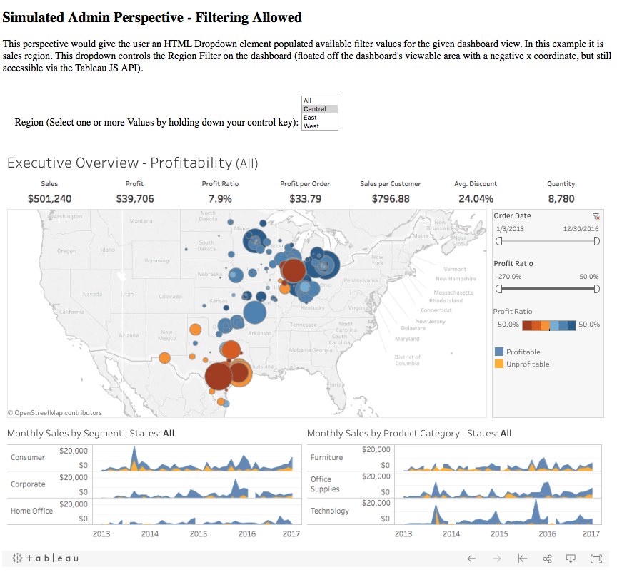
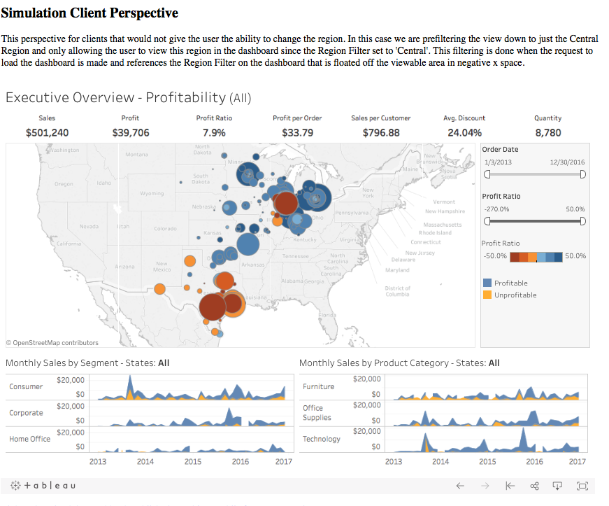

## Tableau API Filtering - Floated Filter Example

Dashboard Filter Visible
-----------------------------------

Dashboard Filter Hidden
--------------

### Purpose
Using Tableau's Javascript API libraries one can extend their embedded dashboards usability to allow for a more flexible way of handling dashboard filters. This example demonstrates a few key concepts:

- Floating dashboard filters into negative space to hide from the visible dashboard view, but still be accessible
- Connect HTML elements such as a dropdown to dashboard filters allowing for greater control in how and where dashboard filter controls can be presented to a user
- Based on user permissions and business rules, one can determine if certain HTML filter elements should render to user, or if the dashboard should pre-filter to specific values

### Future To-dos
Develop additional examples demonstrating the additional functionality of the Tableau JS API capabilities to further expand possibilities of embedded dashboard functionality and presentation.

#### Relevant Resources
https://public.tableau.com/views/Superstore-FilterDemo/Overview?:embed=y&:display_count=yes&publish=yes

https://github.com/tableau/js-api-samples/blob/master/filter.html
